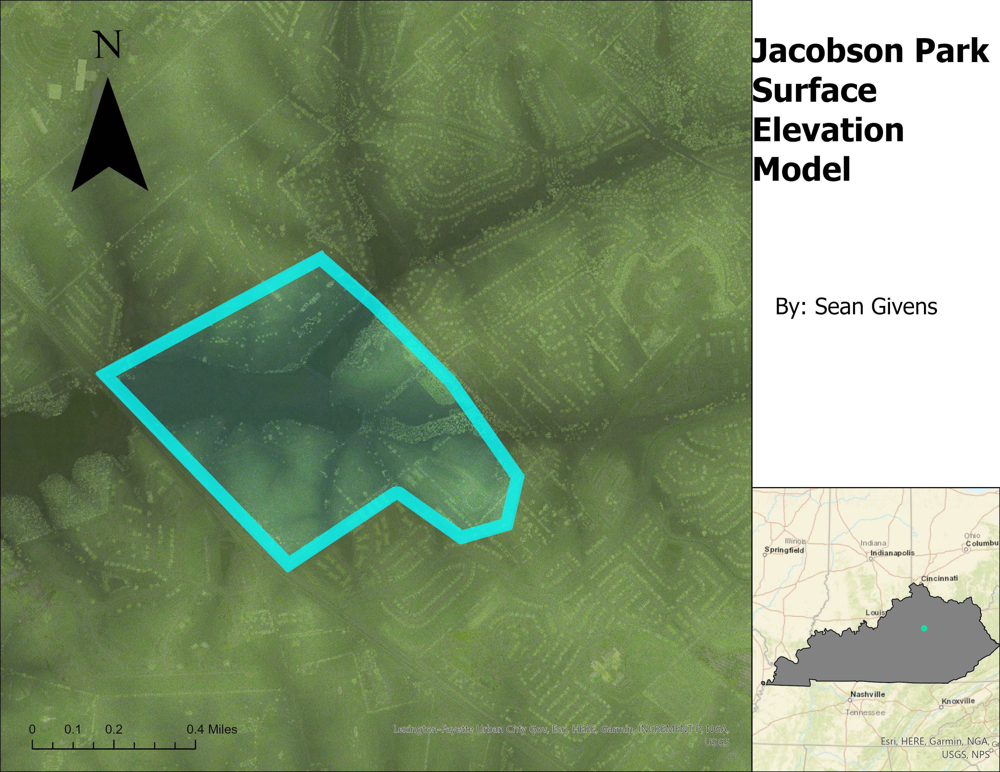

# smgi238-module-7
# Lesson 07: Publishing custom shaded relief maps

## Goals
We will create custom shaded relief visualizations using an open-source 3D application. We continue our goal of publishing content to a public website. 

## Table of Contents

<!-- TOC -->

- [Lesson 07: Publishing custom shaded relief maps](#lesson-07-publishing-custom-shaded-relief-maps)
    - [Goals](#goals)
    - [Table of Contents](#table-of-contents)
    - [Overview](#overview)
    - [Making a custom shaded relief map](#making-a-custom-shaded-relief-map)
        - [Blender support](#blender-support)
        - [Create elevation raster](#create-elevation-raster)
        - [Render scene in Blender](#render-scene-in-blender)
        - [Creating map in ArcGIS Pro](#creating-map-in-arcgis-pro)

<!-- /TOC -->

## Overview

So far in the course, we've used ArcGIS Pro as our primary tool for creating maps. ArcGIS Pro is powerful – and we'll still use it in this lesson – but we have other very capable tools to create visualizations. In this lesson (and the next), we'll explore some of the other applications and platforms available to us.

In this lesson, we'll take a look at making a shaded relief using Blender 3D with above-ground features from lidar data. We'll finish the lesson publishing maps, from ArcGIS Pro to a public webpage that you own. Additionally , we can upload our published map (geospatial PDF or GeoTIFF formats) to the Avenza Maps app. 

## Making a custom shaded relief map

[Blender](https://www.blender.org/) is a free and open source 3D modeling and rendering software that you can install on multiple platforms. We should recognize from outset that we are *not* learning Blender per se; we are using a very specific workflow to create a map from lidar data. 

The primary reason that we are using Blender is its ability to perform [ray tracing](https://www.youtube.com/watch?v=0FMlPUEAZfs) in our scene to create subtle shading effects. In many ways it is aesthetically superior to conventional hillshading techniques. In the below example for Barren River Lake dam, we can see the effect of ray tracing. In areas smooth areas like open fields and water, light is reflected off the surface and illuminates areas nearby. In rougher area, like tree canopy, less light is reflected and the surface appears darker with taller trees.

*Blender: Barren River Lake dam*

*ArcGIS Pro: Barren River Lake dam*

In our demonstration, we will use conservative parameter values that produce a smooth surface suitable for most base maps. Not all scenes will look 'better' than a conventional hillshade, because shading effects might be distracting; note how soft features are in Blender. You will need to perform multiple tests to see if your map is visually appealing. Blender render times are much longer than a conventional hillshade functions. Plan to use small areas to test your changes. 

So, you are encouraged to experiment with different values to see if your map looks better, different, worse, or whatever you like! (Consult the next section.)

### Blender support

Blender is used by professional developers, animators, and artists who are mostly outside of the GIS and mapping disciplines. For help with map applications in Blender, consider these support resources:

* [Creating shaded relied in Blender](https://somethingaboutmaps.wordpress.com/2017/11/16/creating-shaded-relief-in-blender/) by Daniel Huffman and an inspiration to many mappers. After completing this tutorial, watch the following video:
* [Relief Shading in Blender - Tips and Tricks with Peter Atwood](https://www.youtube.com/watch?v=AGczLhQg8yI)
* [How to Create 3D Terrain with Google Maps and Blender!](https://www.youtube.com/watch?v=Mj7Z1P2hUWk)
* [QGIS User 0036 - QGIS and Blender](https://www.youtube.com/watch?v=AJJNX243k9E&t=1194s)

### Create elevation raster

Create a new map project in ArcGIS Pro called, "module-07". For this demonstration, we'll use the first-return DSM image service from *kyraster.ky.gov* and focus on the Barren River Lake dam area. If you wanted to use Phase 2 lidar data, then you will need to create a DSM from the *explore-lidar.ipynb* Notebook.

Blender 3D cannot not use ArcGIS Pro geodatabases. We'll need to export a TIFF file from ArcGIS Pro with special modifications. A typical elevation raster is in a 32-bit floating point data format, which can store an enormous amount of precision. Blender cannot use this format for elevation. We'll use a TIFF file with a 16-bit integer data format which store between values between 0 and 65535. This is a much smaller data format and we'll need to scale the elevation values to between 0 and 65535 to get the maximum precision.

Use the application Notebook: [shaded-relief.ipynb](application/shaded-relief.ipynb) to extract an elevation raster from ArcGIS Pro for an area of interest. The notebook will create a TIFF file with the elevation values scaled to between 0 and 65535. Verify that you have a file called *elevations.tif* in your project folder. Verify that file is a 16-bit integer TIFF file and note its width and height in pixels.

*Step 1: Create an elevation raster for use in Blender*

### Render scene in Blender

Open this Blender scene: [scene.blend](application/scene.blend). If you are not using the most recent version of Blender, you might get an error. This message can be safely ignored (we think), so just cancel and continue. This file is pre-configured to output a shaded relief map from the elevation raster we just completed. We will need to add it to the scene and change the print output settings to match the size of the elevation raster.

By default, the scene should open with the Shader Editor open. If you can't see the flowchart of elements, click the **Editor Type** dropdown button in the top left corner of the Blender window and select, **Shader Editor**. Then select **Plane** in the Scene Collection in the upper right corner.

*Find elements in Shader Editor*

If you look at the right side of the flowchart, you will see a *Material Output* element or *node*. It has two inputs:

1. *Surface* which is defined by the [Principled BSDF](https://docs.blender.org/manual/en/latest/render/shader_nodes/shader/principled.html) material settings. This gives the surface color, specular color, and other material settings. If you created a color image in the notebook addendum, you can use that image as the Base Color. Just 'hook up' the Color output from the *overlay.tif* to the *Base Color* input of the Principled BSDF node.
2. *Displacement* modifier causes the plane to be displaced by the elevation values in the *elevations.tif* file.

Let's now add the *elevations.tif* file to the image input node highlighted in the below screenshot. Next, change the output resolutions to match the elevations.tif file.

*Step 2: Add elevations.tif and set output resolution*

Navigate to the project space to find the *elevations.tif* file.

*Add *elevations.tif**

We now need to change the plane scale to match the pixel dimensions of *elevations.tif* file. We don't have worry about units, but we do need to make sure the dimensions are proportional. For example, if the *elevations.tif* file is 3201 pixels wide and 3201 pixels high, then the plane should be scaled to 3.201 by 3.201.

Select **Plane** in the Scene Collection in the upper right corner of the Blender window. Then select **Object Properties** as shown in the below screenshot. Change the X and Y scale values to match the proportions of the *elevations.tif* file.

*Step 3: Change plane X, Y scale*

We now need to set the Camera's Orthographic scale to match out plane's dimensions using the *elevations.tif* file for displacement. The Orthographic lens will not show perspective and will allow us to use the Blender output in ArcGIS Pro.

Select **Camera** in the Scene Collection in the upper right corner of the Blender window. Then select **Object Data Properties** as shown in the below screenshot. Change orthographic scale to be exact twice the longest dimension of the Plane object. For example, if the *elevations.tif* file is 3201 pixels wide and 3201 pixels high, and you scaled the plane's X and Y dimensions to 3.201 and 3.201, then the orthographic scale should be 6.402.

*Step 4: Change the Camera's orthographic scale*

This is convenient because we are using a square area. If we were using a rectangular area, we would need to change the orthographic scale to match the longer dimension of the area.

OK, are you ready to render the scene? Click the **Render > Render Image** button in the top left corner of the Blender window.

*Step 5: Render Image (might take 10 minutes or 10 hours)*

After the render completes, save the file as *blender.tif* in your project folder.

*Step 6: Save image*

Make a copy of the *elevations.tfw* file in your project folder and rename it to *blender.tfw*. This [world](https://en.wikipedia.org/wiki/World_file) file is a sidecar file that tells our GIS where this image is located and its cell dimensions.

*Step 7: Copy .tfw file*

Now, you can add this shaded relief map to an ArcGIS Pro project and additional layers.

### Creating map in ArcGIS Pro

In the ArcGIS Pro, create a new map project. Before we can use the new layer, we need to set the layer's spatial reference to match the elevation raster. Right click the *blender.tif* file in Catalog and select **Properties > Spatial Reference** and search for EPSG code '3089'.

*Step 8: Set Spatial Reference for *blender.tif* layer*

If your elevation raster created in the *shaded-relief.ipynb* notebook is in a different coordinate system, you need to use the coordinate system here.

Add the layer to a map and see if it lands where it should on the map.

*Verify that your shaded relied is where it should be*

Success! You have created a custom shaded relief map in ArcGIS Pro. Let's add some layers to your map like hydro features we used in a previous module and an NDVI layer that shows vegetation.

After we create a simple map and layout, let's export the layout to a geospatial PDF, which can be printed but also used in mobile map apps without cell phone coverage.

*Step 9: Export Layout as a geospatial PDF*

Save the PDF in the project folder. Make sure the PDF is no larger than 20 MB. If the PDF is over 20 MB, you could reduce the resolution or image quality when exporting the PDF. 

If you can create a custom shaded relief for any part of the state, you are ready to move on to the lab.
# Jacobson Park Surface Elevation Model
## Lexington, Kentucky

This is a lidar scan 3D model of Jacobson Park. The area is a large public park located in Lexington, Kentucky. 

     
*Caption of Map*

[Link to high-resolution version](Jacobsonresolution.pdf)     

Information about the author, data sources, and applications used in the analysis.
